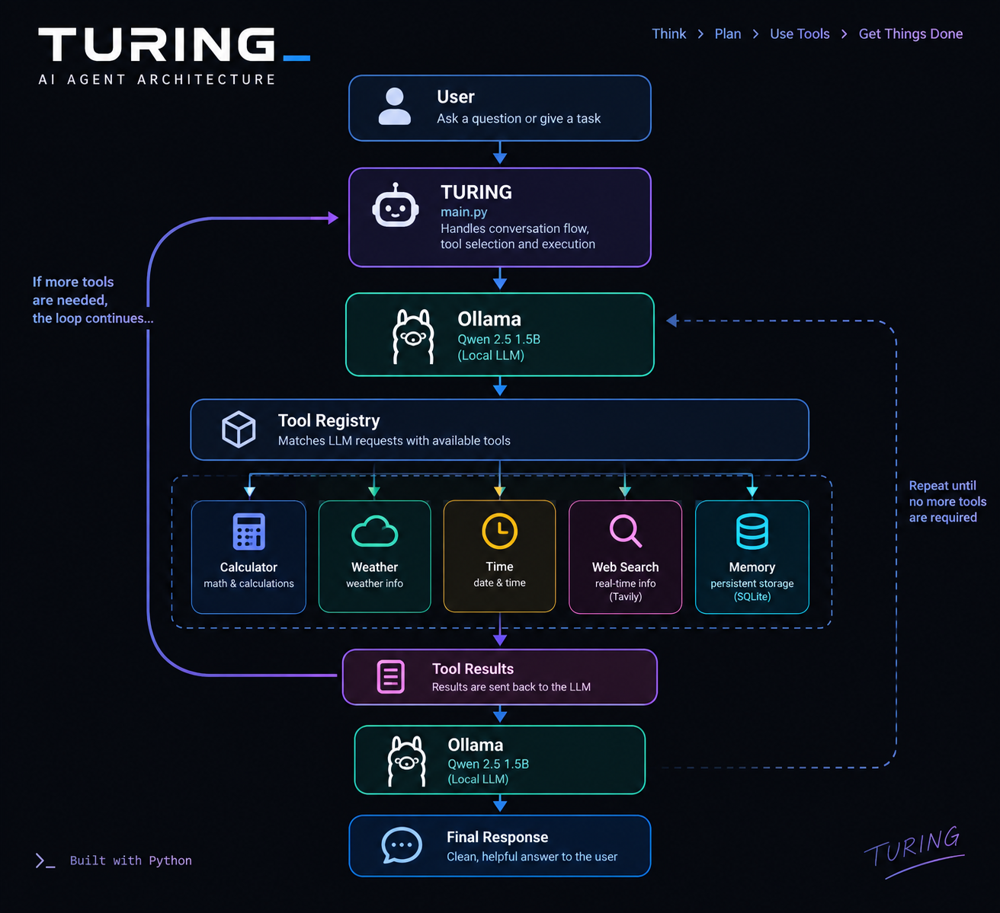

# Turing AI Agent

> A locally running AI agent that can use tools, search the web, and remember information across sessions.

**Python · Ollama · Qwen · SQLite · Tavily**

---

## 🧠 What is Turing?

Turing is a **local AI agent built with Python and Ollama**.

Instead of only generating text, Turing can use external tools, retrieve real-world information, search the web, and store information in persistent memory.

### Current capabilities

- 🧮 Calculator
- 🌤️ Current weather
- ⏰ Time and time zones
- 🌐 Web search
- 🧠 Persistent memory
- 🔗 Multiple tool calls
- 📝 Runtime logging
- 🛡️ Error handling

---

## ⚙️ How It Works

**User → Turing → Local LLM → Tool Registry → Tools → Results → Local LLM → Response**

Turing keeps its tools separate from the main agent through a **tool registry**, making the system easier to extend.

---

## 🔧 Tools

| Tool | Purpose |
|---|---|
| 🧮 Calculator | Mathematical calculations |
| 🌤️ Weather | Current weather information |
| ⏰ Time | Time and time zones |
| 🌐 Web Search | Internet search using Tavily |
| 🧠 Memory | Persistent storage using SQLite |

---

## 🧠 Persistent Memory

Turing can store information in a local SQLite database and retrieve it after the program is restarted.

User → Memory Tool → SQLite → Future Conversation → Turing retrieves the information

---

## 📁 Project Structure

    turing-ai-agent/
    │
    ├── main.py
    ├── README.md
    ├── requirements.txt
    ├── .env
    ├── .gitignore
    │
    ├── data/
    │   └── memory.db
    │
    ├── logs/
    │   └── agent.log
    │
    └── tools/
        ├── calculator.py
        ├── weather.py
        ├── time.py
        ├── memory_tool.py
        ├── web_search.py
        └── registry.py

> `.env` contains private API credentials and should never be committed to GitHub.

---

## 🛠️ Tech Stack

- **Python** — Agent logic and tool execution
- **Ollama** — Local LLM runtime
- **Qwen 2.5** — Language model
- **SQLite** — Persistent memory
- **Tavily** — Web search
- **Open-Meteo** — Weather data
- **python-dotenv** — Environment configuration

---

## 🚀 Run Locally

### 1. Clone the repository

    git clone <repository-url>
    cd turing-ai-agent

### 2. Install dependencies

    pip install -r requirements.txt

### 3. Download the model

    ollama pull qwen2.5:1.5b

Make sure Ollama is running.

### 4. Configure Tavily

Create a `.env` file:

    TAVILY_API_KEY=your_api_key_here

### 5. Run Turing

    python main.py

---

## 🗺️ Roadmap

### Completed

- [x] Local LLM integration
- [x] Conversational context
- [x] Tool calling
- [x] Dynamic tool registry
- [x] Calculator
- [x] Weather
- [x] Time
- [x] Persistent SQLite memory
- [x] Web search
- [x] Multiple tool calls
- [x] Logging
- [x] Error handling

### Next

- [ ] Improved agent loop
- [ ] Multi-step autonomous tasks
- [ ] Tool validation
- [ ] Conversation persistence
- [ ] Relevant memory retrieval
- [ ] Async tool execution
- [ ] Automated testing
- [ ] FastAPI backend
- [ ] Local web interface
- [ ] Document processing
- [ ] RAG

---

## 🎯 Why I'm Building Turing

Turing is a hands-on project for understanding how **AI agents are actually engineered** — combining language models with tools, APIs, databases, memory, and eventually autonomous multi-step workflows.

The goal isn't simply to build another chatbot.

It's to build an agent whose **capabilities and architecture can grow over time**.

---

## 👨‍💻 Author

**Zermello**

Built with Python, curiosity, and a lot of debugging. 🤖

---

> 🚧 Turing is an evolving project. New capabilities are being added as the architecture develops.
